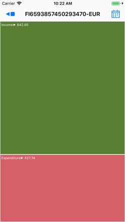
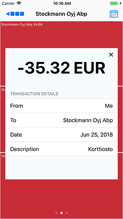

# ExamineSpending iOS App

Simple iOS application demo project that uses two Finnish banks' Open Banking interfaces (Nordea and OP) for visualising  accounts and transactions in a treemap view. ExamineSpending uses API sandbox data, i.e. it cannot be used to view real live account information. In the Nordea Sandbox, it is possible to generate your own test accounts and transactions for testing different scenarios.

  

## Getting Started

To build this app and run it in simulator/device you will need to register to the [Nordea Developer Portal](https://developer.nordeaopenbanking.com/) and [OP Developer Portal](https://op-developer.fi/) for obtaining your own API keys. 

ExamineSpending application is built for [Nordea Accounts API](https://developer.nordeaopenbanking.com/app/accounts) and [OP Accounts API V1](https://op-developer.fi/docs/api/5mYDU9uBkkeUeesoyCMcIw/Accounts). OP has recently released Accounts API v2 and deprecated the older version. ExamineSpending will be changed to support that in a future update.

Once you have the keys, you can add them to the bank-specific request adapter files. Once you've cloned the repository, you'll find the slots for typing in your API keys in *NordeaRequestAdapter.swift* and *OPRequestAdapter.swift* respectively.

### Dependencies

ExamineSpending uses the following third party components:
* [AlamoFire](https://github.com/Alamofire/Alamofire) for network communications
* [SwiftyBeaver](https://github.com/SwiftyBeaver/SwiftyBeaver) for logging
* [YMTreeMap](https://github.com/yahoo/YMTreeMap) for the treemap view generation 
* [SwiftLint](https://github.com/realm/SwiftLint) (optional) ExamineSpending project has a SwiftLint configuration file. If you don't have SwiftLint installed, the build will work but you will get a warning.

The dependencies are configured through CocoaPods and included in the repository for your convenience (except for SwiftLint, which you will need to install on your own).

## License

This project is licensed under the MIT License - see the [LICENSE.md](LICENSE.md) file for details

## Acknowledgments

* The application is built with [Clean Swift](https://github.com/Clean-Swift) templates by **Raymond Law**.

